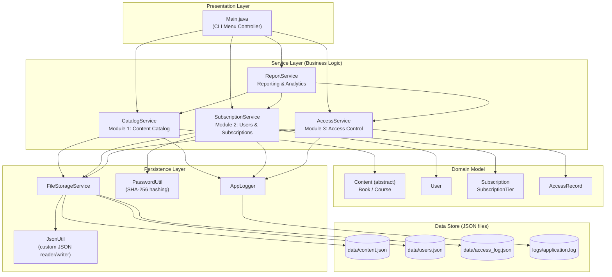
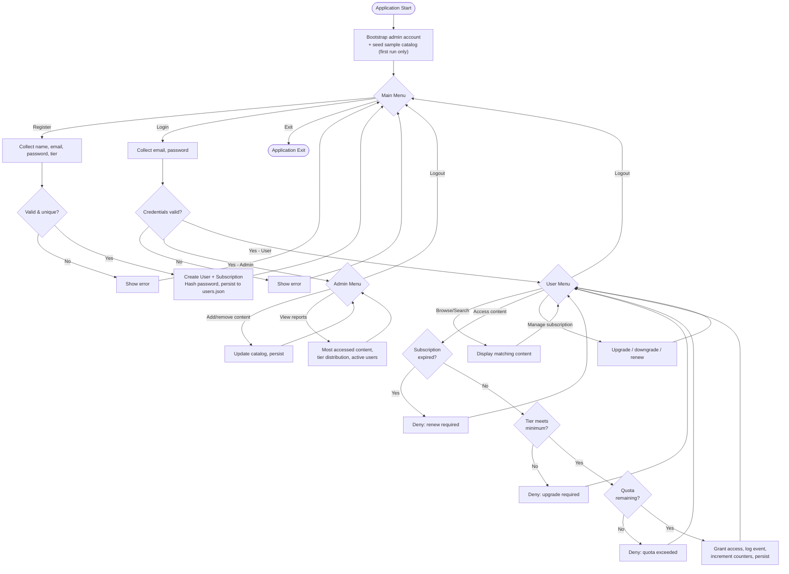

# System Architecture & Workflow

## 1. System Architecture Diagram

```mermaid
flowchart TB
    subgraph CLI["Presentation Layer"]
        Main["Main.java<br/>(CLI Menu Controller)"]
    end

    subgraph Service["Service Layer (Business Logic)"]
        CS["CatalogService<br/>Module 1: Content Catalog"]
        SS["SubscriptionService<br/>Module 2: Users & Subscriptions"]
        AS["AccessService<br/>Module 3: Access Control"]
        RS["ReportService<br/>Reporting & Analytics"]
    end

    subgraph Domain["Domain Model"]
        Content["Content (abstract)<br/>Book / Course"]
        User["User"]
        Sub["Subscription<br/>SubscriptionTier"]
        Rec["AccessRecord"]
    end

    subgraph Persistence["Persistence Layer"]
        FSS["FileStorageService"]
        JU["JsonUtil<br/>(custom JSON reader/writer)"]
        PW["PasswordUtil<br/>(SHA-256 hashing)"]
        Log["AppLogger"]
    end

    subgraph Storage["Data Store (JSON files)"]
        F1[("data/content.json")]
        F2[("data/users.json")]
        F3[("data/access_log.json")]
        F4[("logs/application.log")]
    end

    Main --> CS
    Main --> SS
    Main --> AS
    Main --> RS

    CS --> Content
    SS --> User
    SS --> Sub
    AS --> Rec
    RS --> CS
    RS --> SS
    RS --> AS

    CS --> FSS
    SS --> FSS
    AS --> FSS
    SS --> PW
    CS --> Log
    SS --> Log
    AS --> Log

    FSS --> JU
    FSS --> F1
    FSS --> F2
    FSS --> F3
    Log --> F4
```

## 2. Process Flow / Workflow Diagram

```mermaid
flowchart TD
    Start([Application Start]) --> Bootstrap["Bootstrap admin account<br/>+ seed sample catalog (first run only)"]
    Bootstrap --> Menu{Main Menu}

    Menu -->|Register| Register["Collect name, email, password, tier"]
    Register --> Validate1{Valid & unique?}
    Validate1 -->|No| RegError["Show error"] --> Menu
    Validate1 -->|Yes| CreateUser["Create User + Subscription<br/>Hash password, persist to users.json"]
    CreateUser --> Menu

    Menu -->|Login| Login["Collect email, password"]
    Login --> Auth{Credentials valid?}
    Auth -->|No| LoginError["Show error"] --> Menu
    Auth -->|Yes - Admin| AdminMenu{Admin Menu}
    Auth -->|Yes - User| UserMenu{User Menu}

    UserMenu -->|Browse/Search| ShowCatalog["Display matching content"] --> UserMenu
    UserMenu -->|Access content| CheckAccess{Subscription<br/>expired?}
    CheckAccess -->|Yes| DenyExpired["Deny: renew required"] --> UserMenu
    CheckAccess -->|No| CheckTier{Tier meets<br/>minimum?}
    CheckTier -->|No| DenyTier["Deny: upgrade required"] --> UserMenu
    CheckTier -->|Yes| CheckQuota{Quota<br/>remaining?}
    CheckQuota -->|No| DenyQuota["Deny: quota exceeded"] --> UserMenu
    CheckQuota -->|Yes| GrantAccess["Grant access, log event,<br/>increment counters, persist"]
    GrantAccess --> UserMenu

    UserMenu -->|Manage subscription| ManageSub["Upgrade / downgrade / renew"] --> UserMenu
    UserMenu -->|Logout| Menu

    AdminMenu -->|Add/remove content| ManageCatalog["Update catalog, persist"] --> AdminMenu
    AdminMenu -->|View reports| Reports["Most accessed content,<br/>tier distribution, active users"] --> AdminMenu
    AdminMenu -->|Logout| Menu

    Menu -->|Exit| End([Application Exit])
```
