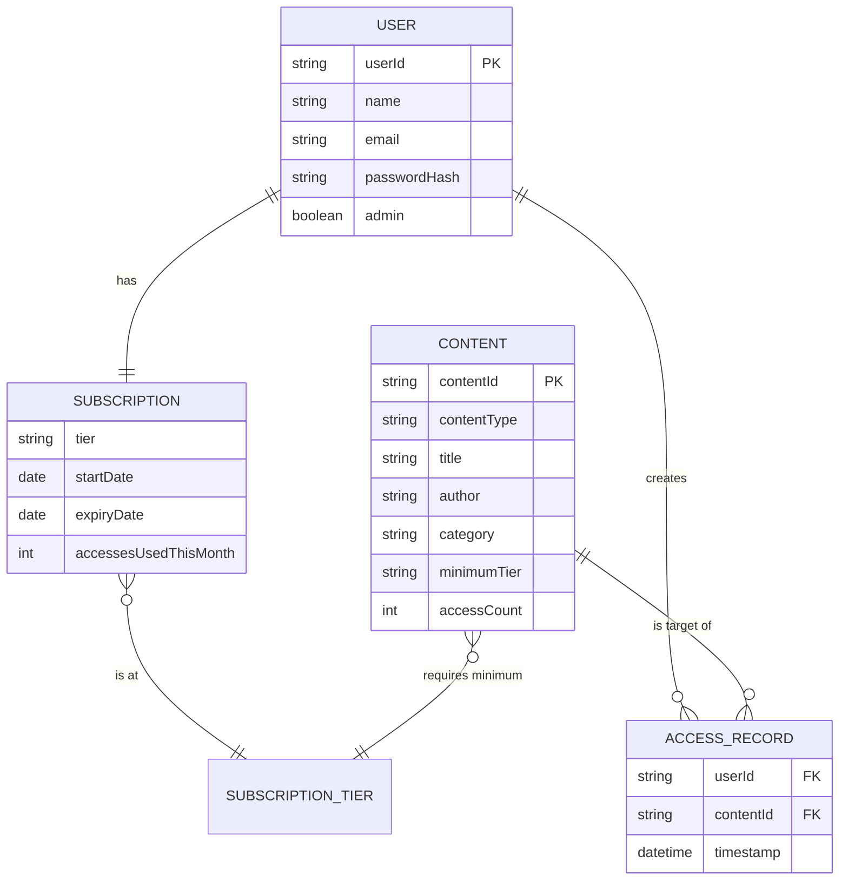

# Data / Storage Design

The system does not use a relational database — it uses JSON files as a
lightweight persistent store, read and written through `FileStorageService`
using a custom, dependency-free JSON reader/writer (`JsonUtil`). This keeps
the project runnable with nothing but a plain JDK (no database server,
JDBC driver, or Maven/Gradle setup required by the evaluator).

Each JSON file below plays the same conceptual role as a table would in a
relational schema, and `contentId` / `userId` act as primary keys.

## `data/users.json`

```json
[
  {
    "userId": "USR-XXXXXXXX",
    "name": "string",
    "email": "string (unique)",
    "passwordHash": "string (SHA-256 hex digest)",
    "admin": "boolean",
    "subscription": {
      "tier": "FREE | BASIC | PREMIUM",
      "startDate": "YYYY-MM-DD",
      "expiryDate": "YYYY-MM-DD",
      "accessesUsedThisMonth": "number"
    },
    "accessedContentIds": ["string", "..."]
  }
]
```

## `data/content.json`

```json
[
  {
    "contentType": "Book | Course",
    "contentId": "BK-XXXXXXXX | CR-XXXXXXXX",
    "title": "string",
    "author": "string",
    "category": "string",
    "minimumTier": "FREE | BASIC | PREMIUM",
    "accessCount": "number",

    "pageCount": "number (Book only)",
    "isbn": "string (Book only)",

    "durationHours": "number (Course only)",
    "numberOfLectures": "number (Course only)"
  }
]
```

## `data/access_log.json`

```json
[
  {
    "userId": "string (foreign key -> users.json.userId)",
    "contentId": "string (foreign key -> content.json.contentId)",
    "timestamp": "ISO-8601 LocalDateTime string"
  }
]
```

## Relationships (equivalent to an ER diagram)


