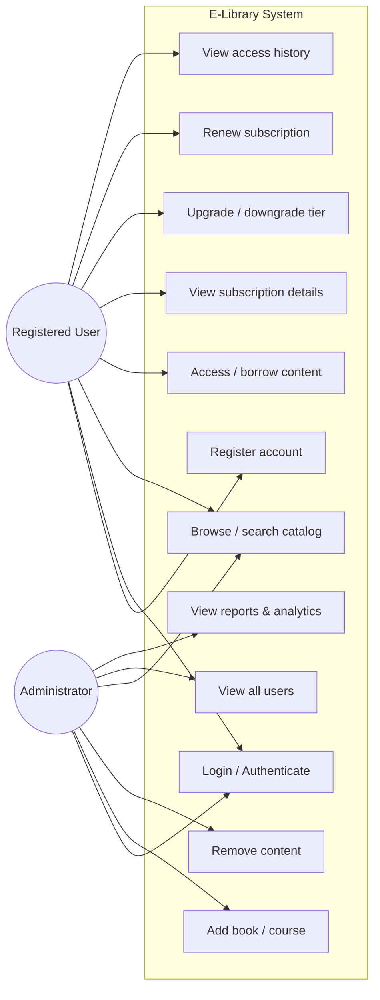
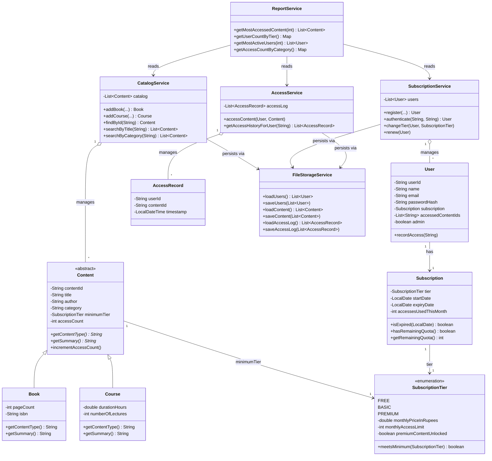
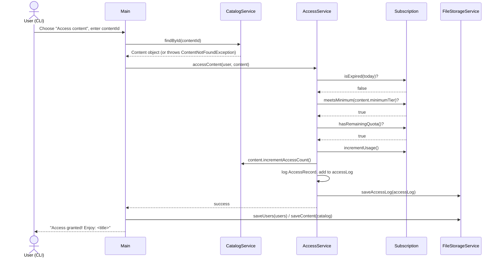

# UML Diagrams

## 1. Use Case Diagram

```mermaid
flowchart LR
    User((Registered User))
    Admin((Administrator))

    subgraph System["E-Library System"]
        UC1["Register account"]
        UC2["Login / Authenticate"]
        UC3["Browse / search catalog"]
        UC4["Access / borrow content"]
        UC5["View subscription details"]
        UC6["Upgrade / downgrade tier"]
        UC7["Renew subscription"]
        UC8["View access history"]
        UC9["Add book / course"]
        UC10["Remove content"]
        UC11["View all users"]
        UC12["View reports & analytics"]
    end

    User --> UC1
    User --> UC2
    User --> UC3
    User --> UC4
    User --> UC5
    User --> UC6
    User --> UC7
    User --> UC8

    Admin --> UC2
    Admin --> UC9
    Admin --> UC10
    Admin --> UC3
    Admin --> UC11
    Admin --> UC12
```

## 2. Class Diagram

```mermaid
classDiagram
    class Content {
        <<abstract>>
        -String contentId
        -String title
        -String author
        -String category
        -SubscriptionTier minimumTier
        -int accessCount
        +getContentType() String*
        +getSummary() String*
        +incrementAccessCount()
    }

    class Book {
        -int pageCount
        -String isbn
        +getContentType() String
        +getSummary() String
    }

    class Course {
        -double durationHours
        -int numberOfLectures
        +getContentType() String
        +getSummary() String
    }

    class SubscriptionTier {
        <<enumeration>>
        FREE
        BASIC
        PREMIUM
        -double monthlyPriceInRupees
        -int monthlyAccessLimit
        -boolean premiumContentUnlocked
        +meetsMinimum(SubscriptionTier) boolean
    }

    class Subscription {
        -SubscriptionTier tier
        -LocalDate startDate
        -LocalDate expiryDate
        -int accessesUsedThisMonth
        +isExpired(LocalDate) boolean
        +hasRemainingQuota() boolean
        +getRemainingQuota() int
    }

    class User {
        -String userId
        -String name
        -String email
        -String passwordHash
        -Subscription subscription
        -List~String~ accessedContentIds
        -boolean admin
        +recordAccess(String)
    }

    class AccessRecord {
        -String userId
        -String contentId
        -LocalDateTime timestamp
    }

    class CatalogService {
        -List~Content~ catalog
        +addBook(...) Book
        +addCourse(...) Course
        +findById(String) Content
        +searchByTitle(String) List~Content~
        +searchByCategory(String) List~Content~
    }

    class SubscriptionService {
        -List~User~ users
        +register(...) User
        +authenticate(String, String) User
        +changeTier(User, SubscriptionTier)
        +renew(User)
    }

    class AccessService {
        -List~AccessRecord~ accessLog
        +accessContent(User, Content)
        +getAccessHistoryForUser(String) List~AccessRecord~
    }

    class ReportService {
        +getMostAccessedContent(int) List~Content~
        +getUserCountByTier() Map
        +getMostActiveUsers(int) List~User~
        +getAccessCountByCategory() Map
    }

    class FileStorageService {
        +loadUsers() List~User~
        +saveUsers(List~User~)
        +loadContent() List~Content~
        +saveContent(List~Content~)
        +loadAccessLog() List~AccessRecord~
        +saveAccessLog(List~AccessRecord~)
    }

    Content <|-- Book
    Content <|-- Course
    Content "1" --> "1" SubscriptionTier : minimumTier
    User "1" --> "1" Subscription : has
    Subscription "1" --> "1" SubscriptionTier : tier
    CatalogService "1" o-- "*" Content : manages
    SubscriptionService "1" o-- "*" User : manages
    AccessService "1" o-- "*" AccessRecord : manages
    ReportService --> CatalogService : reads
    ReportService --> SubscriptionService : reads
    ReportService --> AccessService : reads
    CatalogService --> FileStorageService : persists via
    SubscriptionService --> FileStorageService : persists via
    AccessService --> FileStorageService : persists via
```

## 3. Sequence Diagram — "User accesses a piece of content"

```mermaid
sequenceDiagram
    actor U as User (CLI)
    participant M as Main
    participant CS as CatalogService
    participant AS as AccessService
    participant Sub as Subscription
    participant FSS as FileStorageService

    U->>M: Choose "Access content", enter contentId
    M->>CS: findById(contentId)
    CS-->>M: Content object (or throws ContentNotFoundException)
    M->>AS: accessContent(user, content)
    AS->>Sub: isExpired(today)?
    Sub-->>AS: false
    AS->>Sub: meetsMinimum(content.minimumTier)?
    Sub-->>AS: true
    AS->>Sub: hasRemainingQuota()?
    Sub-->>AS: true
    AS->>Sub: incrementUsage()
    AS->>CS: content.incrementAccessCount()
    AS->>AS: log AccessRecord, add to accessLog
    AS->>FSS: saveAccessLog(accessLog)
    AS-->>M: success
    M->>FSS: saveUsers(users) / saveContent(catalog)
    M-->>U: "Access granted! Enjoy: <title>"
```
